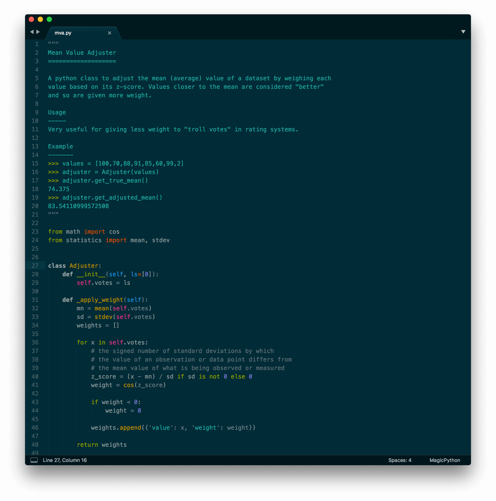

# Okami – Adaptive Color Schemes

A set of dark and light color schemes named after Japanese deities.

[Fork on Github](https://github.com/rayraegah/okami) | [Report a bug or request a feature](https://github.com/rayraegah/okami/issues) | [Contribute](https://github.com/rayraegah/okami/pulls)

## Sublime Text 3

### Dark color schemes

**Tsukiyomi** uses true solarized dark colors scheme and named after the _god of the moon_.


**Susano** borrows from cobalt color scheme and named after the _god of storms_.


### Light color schemes

**Amaterasu** uses true solarized light colors scheme and named after the _goddess of the sun_.


**Hachiman** borrows from celeste color scheme and named after the _god of water_.


## Installation

### Install using Package Control

If you are using Package Control, you can easily install Okami – Adaptive Color Schemes via the Package Control: Install Package menu item. The Okami color schemes is listed as Okami – Adaptive Color Schemes in the packages list.

### Install using Git

Alternatively, if you are a git user, you can install the color scheme and keep up to date by cloning the repo directly into your Packages directory in the Sublime Text application settings area.

You can locate your Sublime Text Packages directory by using the menu item Preferences -> Browse Packages....

While inside the Packages directory, clone the theme repository using the command below:

```bash
git clone https://github.com/dracula/sublime.git "Okami"
```

### Install manually

1.  Download using the GitHub .zip download option
2.  Unzip the files and rename the folder to Okami
3.  Find your Packages directory using the menu item Preferences -> Browse Packages...
4.  Copy the folder into your Sublime Text Packages directory

## Activating theme

Go to Preferences -> Color Scheme -> User and select one of the themes listed below

1.  Amaterasu
2.  Hachiman
3.  Tsukiyomi
4.  Susano

## Naming guidelines

If you create and distribute a derivative color scheme, please give your color scheme a unique and name that does not directly include "Okami – Adaptive Color Scheme", "Amaterasu", "Tsukiyomi", "Hachiman", "Susano" (or a close variant of these) in the main project title, color scheme name, repo name or Package Control name.

This is to avoid confusion :)

## License

Okami – Adaptive Color Scheme is released under the MIT License.
